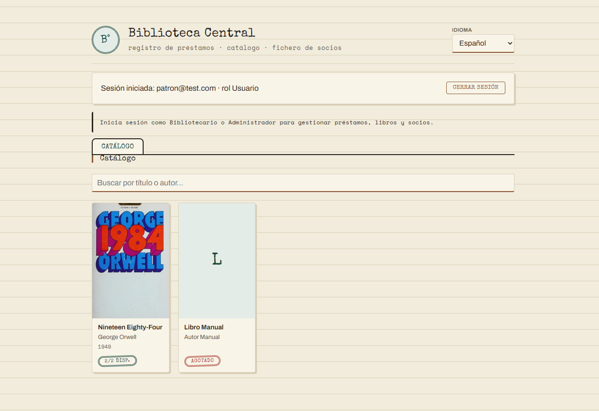
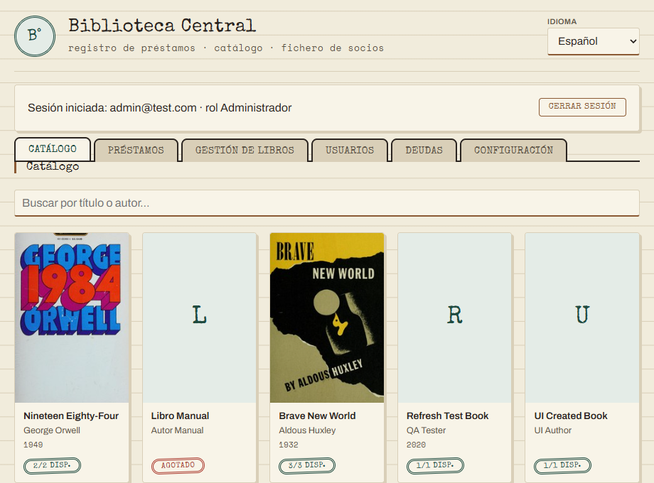

# Rediseño de navegación + Catálogo público

Documento de entrega. Redistribuye la navegación de la app para que se
sienta más como una biblioteca online real (no solo un panel de
back-office), y agrega una pestaña de **Catálogo** — portada, título,
autor y año de cada libro — visible para cualquier socio logueado.

---

## 1. Qué cambió en el acceso

Antes, un socio con rol `USUARIO` que iniciaba sesión no veía **nada**:
toda la app (Préstamos, Libros, Usuarios, Deudas, Configuración) estaba
detrás de un aviso "inicia sesión como bibliotecario o administrador".
Ahora:

| | Antes | Ahora |
|---|---|---|
| `USUARIO` | No ve nada, solo el aviso | Ve el **Catálogo** (solo lectura) |
| `BIBLIOTECARIO` / `ADMINISTRADOR` | Ven las 5 pestañas de gestión | Ven Catálogo + las mismas 5 pestañas, sin cambios de permisos |
| Pestaña por defecto al entrar | "Préstamos" (un formulario) | **Catálogo** (el estante), para todos los roles |

Las pestañas de gestión (Préstamos, **Gestión de libros** — antes
"Libros", Usuarios, Deudas, Configuración) siguen exactamente igual que
antes: mismos permisos, mismo código de backend, cero cambios de
seguridad. Se renombró "Libros" a "Gestión de libros" solo para no
confundirla con el nuevo Catálogo (dos pestañas hablando de libros con
nombre distinto habría sido confuso).

**Captura — `USUARIO` plano, ve solo el Catálogo:**



**Captura — Administrador, ve Catálogo + todas las pestañas de gestión:**



## 2. Persistir portada y año (necesario para el Catálogo)

El Catálogo pedía "portada, título, autor y año" — pero `Book` solo
guardaba `{title, author}`; la portada/año que trae Open Library se usaba
solo de forma transitoria para llenar el formulario, nunca se guardaba.
Esto retoma la recomendación #1 de la evaluación de metadatos hecha en
`docs/servicio-externo-openlibrary.md` §5.

- **Nuevas columnas** `cover_url` / `publish_year` en `books` (nullable,
  ambas opcionales) — `database/schema.sql`, `backend/database/schema.postgres.sql`.
- **Migración para bases ya existentes**: `CREATE TABLE IF NOT EXISTS` no
  agrega columnas a una tabla que ya existe. Postgres soporta `ALTER
  TABLE ... ADD COLUMN IF NOT EXISTS` nativo, así que ahí alcanza con
  agregarlo al schema. El SQLite embebido en `node:sqlite` **no** soporta
  esa sintaxis (probado: da `syntax error`) — se agregó un helper mínimo
  en `Database.ts` que lee `PRAGMA table_info` y solo altera si la
  columna todavía no existe. Verificado localmente: se corrió dos veces
  seguidas contra una base con el schema viejo — agrega las columnas la
  primera vez, no rompe nada la segunda, y las filas existentes quedan
  con `coverUrl`/`publishYear` en `null`.
- **`BookService`**: `createBook`/`updateBook` reciben los dos campos
  como opcionales; `publishYear` se valida (entero, entre 1000 y el año
  que viene) con el mismo estilo que la validación de cantidad ya
  existente.
- **Frontend**: cuando se agrega o edita un libro usando la búsqueda de
  Open Library (`applyBookResult`, de la entrega anterior), la portada y
  el año que trae la búsqueda ahora viajan con el `POST`/`PUT` en vez de
  perderse. Un libro dado de alta escribiendo título/autor a mano
  simplemente queda sin portada — el Catálogo le muestra un placeholder
  (inicial del título sobre fondo papel) en vez de una imagen rota.

## 3. El Catálogo en sí

- Grilla de tarjetas (CSS grid, no tabla) — portada o placeholder, título,
  autor, año si existe, y una insignia de disponibilidad reutilizando el
  patrón ya existente (`X/Y disp.` en verde, "Agotado" en rojo si 0).
- **Buscador cliente-side**, sin red: filtra por título o autor a medida
  que se tipea. Función pura `filterBooks(books, query)` en
  `frontend/catalog.js`, con sus propios tests — mismo patrón que
  `format.js`/`validators.js`/`openLibrary.js`. Verificado que no dispara
  ninguna petición de red al filtrar.
- Es de solo lectura (sin botones de préstamo/edición) — la gestión sigue
  viviendo en "Gestión de libros". Se dejó así a propósito: `Account`
  (login) y `User`/socio (a quién se le presta un libro) son dos
  entidades separadas sin vínculo hoy en el modelo de datos; un botón de
  "pedir prestado este libro" desde el Catálogo implicaría resolver esa
  relación primero — queda fuera de alcance de este cambio.
- Se carga con `GET /api/v1/books`, ya accesible para cualquier rol
  logueado (el backend no necesitó ningún cambio de permisos). Se
  refresca automáticamente después de cualquier alta/edición/baja de
  libro hecha por el personal, para no quedar desactualizado.

## 4. Pruebas

7 tests nuevos (`node:test`):

- `frontend/catalog.test.js` (5): `filterBooks` — sin query devuelve todo,
  coincide por título, coincide por autor sin importar mayúsculas, sin
  coincidencias, no rompe con libros sin autor/título.
- `backend/.../BookService.test.ts` (+3): `coverUrl`/`publishYear`
  opcionales al crear, rechazo de años inválidos (no entero, fuera de
  rango) en alta y edición, actualización de ambos campos al editar.

```
frontend: npm test → 29/29 ✔
backend:  npx tsc --noEmit && npm test → 30/30 ✔
backend:  npm run i18n:check → completo (4 idiomas)
```

Probado en vivo de punta a punta (SQLite local, no solo con fixtures):
migración idempotente confirmada corriendo dos veces contra una base con
el schema viejo; `USUARIO` plano logueado ve únicamente el Catálogo, sin
las pestañas de gestión; administrador ve todo; libro agregado vía
búsqueda de Open Library aparece con portada real en el Catálogo sin
recargar la página; filtro de búsqueda sin llamadas de red; libros sin
portada muestran el placeholder en vez de una imagen rota.
