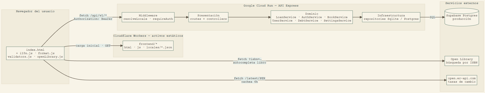
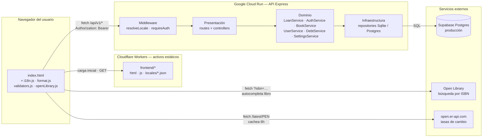

# Diagrama de componentes — Biblioteca Central

Documento de entrega. Diagrama de componentes de la app: frontend
estático, las 3 capas del backend, y los servicios externos que consume.
Es documentación del proyecto — no forma parte de la aplicación
desplegada; vive solo en este repo (`docs/`) para consulta y entrega.

## El diagrama

Cada flecha nombra la llamada real: el navegador pide los archivos
estáticos a Cloudflare, habla con la API por Bearer token, y consulta Open
Library / open.er-api.com directo desde el cliente — sin pasar por el
backend. Dentro de la API, cada capa solo conoce a la siguiente:
Presentación no toca Infraestructura directo.

## Las tres capas del backend

| Capa | Carpeta | Responsabilidad |
|---|---|---|
| **Presentación** | `routes/` + `controllers/` | Traduce HTTP a llamadas de dominio: valida el shape del body, arma la respuesta JSON, decide el status por el `code` del error (nunca por su texto). |
| **Dominio** | `services/` | Las reglas de negocio reales: un préstamo vencido bloquea uno nuevo, la multa se calcula por hora, un registro nunca puede autoasignarse ADMINISTRADOR. No sabe si los datos vienen de SQLite o Postgres. |
| **Infraestructura** | `repositories/` | Dos implementaciones intercambiables de cada interfaz (`Sqlite*Repository` / `Postgres*Repository`) — local sin dependencias, o Supabase en producción, según exista `DATABASE_URL`. |

## Qué cruza cada límite

El **frontend** nunca toca la base de datos directo — todo pasa por
`/api/v1/*` con el token que devuelve el login. Dos llamadas sí evitan el
backend a propósito: la búsqueda de libros por ISBN y la tasa de cambio,
porque son consultas de solo lectura a servicios públicos, sin datos
propios de la app de por medio (ver `docs/servicio-externo-openlibrary.md`
y `docs/i18n.md`). El **middleware** (`resolveLocale`, `requireAuth`) corre
antes de cualquier ruta — por eso aparece como una capa propia y no dentro
de cada controller. La **infraestructura** es el único componente que sabe
qué motor de base de datos hay detrás; si mañana cambia, ninguna otra capa
se entera.

## Fuente del diagrama (Mermaid)

Por si hace falta editarlo — no se usa para renderizarlo (la imagen de
arriba ya es la versión final):

