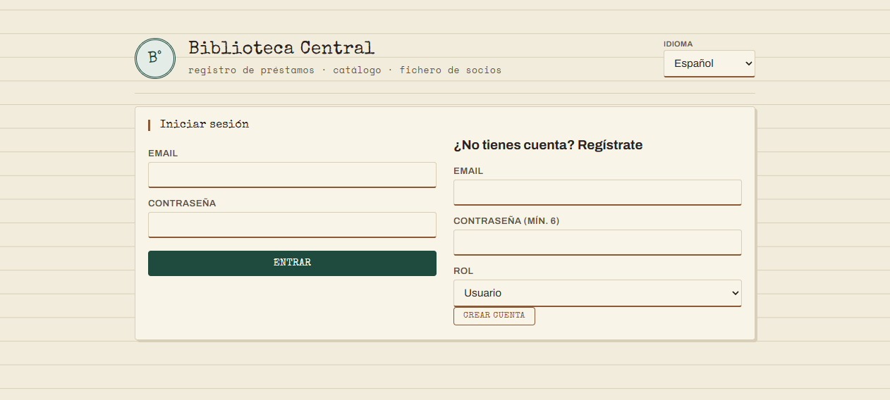
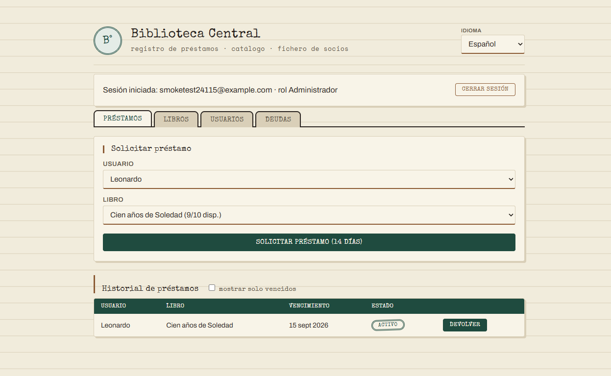
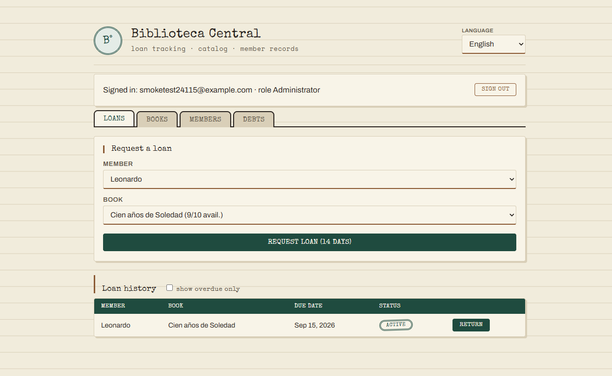
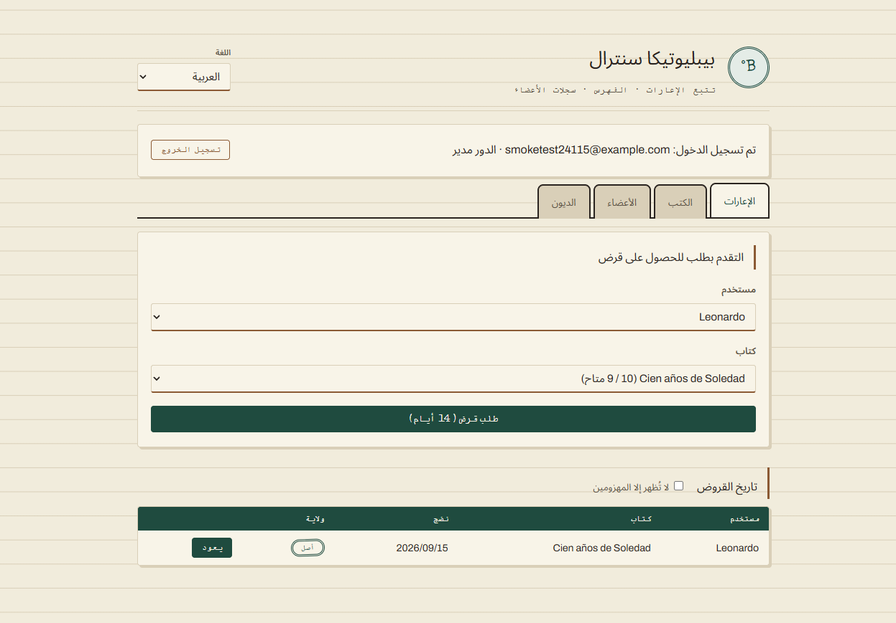
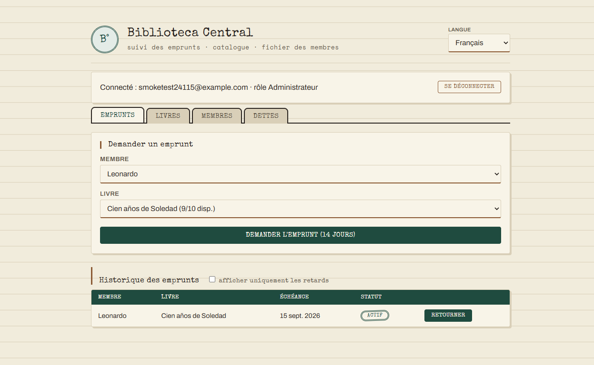

# Internacionalización (i18n) — Biblioteca Central

Documento de entrega. Describe la implementación de i18n del sistema: texto,
mensajes de error, accesibilidad, numeración, moneda, fecha/hora/zona
horaria, dirección de texto (RTL) y el pipeline de traducción automatizado.

**Idiomas soportados:** Español (base), English, العربية (RTL), Français.

---

## 1. Por qué y cómo se hizo

Antes de esta implementación, la app era monolingüe: ~30 mensajes de error
hardcodeados en español (algunos comparados por texto literal para decidir
el status HTTP — frágil), todo el HTML/JS con textos fijos, fechas sin
locale ni timezone explícitos, y montos sin formato de moneda (un `$`
hardcodeado pese a que la moneda real es soles).

La solución separa **texto** de **código**: nada en el dominio o en el DOM
tiene un mensaje fijo — todo es una *clave* (`BOOK_NOT_FOUND`,
`loans.badgeActive`, …) resuelta contra un catálogo JSON por idioma. Backend
y frontend siguen el mismo patrón por separado (son despliegues
independientes: Cloud Run y Cloudflare Workers).

---

## 2. Backend (`backend/src/domain/i18n/`)

- **`BusinessError`** ahora lleva `code` (+ `params` opcionales) en vez de un
  mensaje en español. Ejemplo: `throw new BusinessError("LOAN_MAX_ACTIVE", { max: 3, count: 3 })`.
- **`t.ts`**: traductor puro (`t(code, locale, params)`), sin BD ni red.
  Soporta:
  - **Placeholders**: `"{max} préstamos"` → interpolación simple.
  - **Pluralización**: entradas `{ one, other }` resueltas con
    `Intl.PluralRules` nativo (sin librería).
  - **Traducciones automáticas**: entradas `{ text, mt: true }`, marca de
    "traducción automática, a revisar".
- **`locale.ts`** (middleware): resuelve `req.locale` desde `?lang=` o
  `Accept-Language`, corre antes de todas las rutas.
- **`handleBusinessError.ts`**: único lugar que traduce y decide el status
  HTTP — por **código** (`_NOT_FOUND` → 404, resto → 422), no por texto.
- Catálogos: `locales/{es,en,ar,fr}.json`.

```json
// locales/es.json (fragmento)
"LOAN_MAX_ACTIVE": {
  "one": "El usuario ya tiene {max} préstamo activo.",
  "other": "El usuario ya tiene {max} préstamos activos."
}
```

**Endpoints** (todos bajo `/api/v1`) aceptan `?lang=es|en|ar|fr` o negocian
por `Accept-Language`. Ejemplo real contra producción:

```
GET /api/v1/books?lang=fr   (sin sesión)
→ 401 {"code":"AUTH_REQUIRED","error":"Connexion requise."}
```

---

## 3. Frontend (`frontend/`)

- **`format.js`**: funciones puras y testeables (`translate`, `formatCurrency`,
  `formatDate`, `interpolate`) — mismo módulo se importa desde el navegador
  (`<script src="format.js">`) y desde `node --test` (UMD mínimo, sin bundler).
- **`i18n.js`**: orquestación en el navegador — carga `locales/<lang>.json`,
  actualiza `document.documentElement.lang/dir`, expone `t()` /
  `formatCurrency()` / `formatDate()` / `translateError()` globales,
  persiste el idioma elegido en `localStorage`, traduce el DOM vía atributos
  `data-i18n` / `data-i18n-<attr>`.
- **`locales/{es,en,ar,fr}.json`** + `locales/meta.json` (dirección y
  nombre nativo de cada idioma — nada de "si es árabe, dir=rtl" hardcodeado
  en el código).
- **`index.html`**: cero texto fijo. Selector de idioma en el header.

### Moneda, fecha y zona horaria

Los montos se guardan siempre en soles (PEN) en la base de datos. El
frontend los **convierte de verdad** a la moneda de cada idioma, no solo
cambia el símbolo:

| Idioma | Moneda mostrada |
|---|---|
| Español | PEN (sin conversión) |
| English | USD |
| Français | EUR |
| العربية | USD |

La tasa de cambio sale de una API gratuita sin API key
([open.er-api.com](https://open.er-api.com), base PEN), se guarda en
`localStorage` por 6 horas para no pedirla en cada carga, y solo se pide si
el idioma activo usa una moneda distinta a PEN (español no dispara ninguna
llamada de red). Si la API falla o no hay red, la conversión de un monto se
descarta y ese monto se muestra en soles en vez de inventar un "1 a 1"
engañoso — nunca revienta la página.

```js
// format.js (puro): no sabe de dónde sale la tasa
convertAmount(amountInPEN, rate)                 // amountInPEN * rate
formatCurrency(amount, locale, currency = 'PEN')  // Intl.NumberFormat, solo formatea

// i18n.js (con estado): busca/cachea la tasa y arma el monto final
formatCurrency(amountInPEN)  // usa la moneda del idioma activo (frontend/locales/meta.json)
```

```js
formatDate(iso, locale, tz)    // Intl.DateTimeFormat, timezone autodetectada
                                // del navegador (Intl.DateTimeFormat().resolvedOptions().timeZone)
```

El backend siempre entrega fechas en UTC (ISO 8601) y montos en soles; el
formateo/conversión/zona horaria es responsabilidad exclusiva del cliente —
así cada usuario ve su moneda y hora local sin que el servidor tenga que
saber nada de eso.

**Mismo monto (4000 PEN), tres monedas** — español sin conversión, inglés y
francés con la tasa de cambio real del momento:


### Accesibilidad

La app no tenía ningún `aria-*` antes de esto. Se agregó:

- Patrón ARIA completo de pestañas: `role="tablist"` / `role="tab"` +
  `aria-selected` / `role="tabpanel"`.
- `role="dialog" aria-modal="true"` en el modal de detalle de socio.
- `aria-live="polite"` en todos los banners de resultado (éxito/error se
  anuncian a lectores de pantalla sin que el usuario tenga que buscarlos).
- Las etiquetas ARIA salen del mismo catálogo de i18n (`data-i18n-aria-label`),
  no están escritas aparte en un solo idioma.

### Dirección de texto (RTL)

CSS reescrito con propiedades lógicas en vez de físicas:

```css
/* antes */          /* después */
padding-left: 14px;  padding-inline-start: 14px;
border-left: 3px;    border-inline-start: 3px;
text-align: left;    text-align: start;
```

Con esto, elegir árabe voltea `dir="rtl"` en `<html>` y **todo el layout se
espeja solo** (header, tabs, formularios, tablas) sin una sola regla CSS
específica para árabe. Ver capturas §6.

---

## 4. Pruebas de localización

18 tests (`node:test`, mismo runner que ya usaba el proyecto, sin frameworks
nuevos):

| Archivo | Qué prueba |
|---|---|
| `backend/.../i18n/t.test.ts` | Interpolación, pluralización, fallback de clave desconocida, `LOCALE_META` (ltr/rtl correcto por idioma) |
| `backend/.../i18n/completeness.test.ts` | Todo código de `BusinessError` realmente usado tiene traducción en `es.json` |
| `backend/.../i18n/placeholders.test.ts` | **Cada traducción usa los mismos `{placeholders}` que el texto base** — ver bug real en §5 |
| `frontend/format.test.js` | Las mismas garantías (`translate`, `formatCurrency`, `formatDate`) para el lado del navegador |

`npm run i18n:check` (backend) es la red de seguridad "sin red, sin API
key": compara claves y placeholders de **todos** los locales — backend y
frontend — contra el idioma base, y falla el build si algo quedó sin
traducir o con una traducción que rompe la interpolación.

---

## 5. Automatización de traducción

`npm run i18n:translate` (`backend/scripts/i18n-translate.ts`) usa **Google
Cloud Translation API** para llenar automáticamente las claves que falten en
cada idioma, comparando contra `es.json` (fuente de verdad). Cada texto
generado se marca `{ text, mt: true }` — "traducción automática, revisar".

Se usó en vivo para completar `frontend/locales/ar.json` (82 claves). En el
camino aparecieron dos bugs reales de la automatización, ya corregidos:

1. **Google traducía el propio placeholder**: `{email}` → `{البريد الإلكتروني}`,
   dejando la interpolación rota en tiempo de ejecución. Se arregló
   envolviendo cada `{placeholder}` en `<span class="notranslate">` y
   pidiendo `format=html` — la API respeta ese span y no lo traduce. La
   prueba de placeholders (§4) es justamente la regresión de este bug.
2. **Corte de red a mitad de corrida** (`ECONNRESET` real): el script ahora
   escribe el archivo tras **cada** clave traducida (no al final del
   locale) y reintenta una vez ante fallas transitorias — una corrida
   interrumpida retoma donde quedó en vez de perder el progreso.

---

## 6. Capturas

**Login / registro (español, idioma por defecto):**



**Panel de gestión en español:**



**Mismo panel en inglés** (cambia texto, fechas y moneda; layout LTR sin cambios):



**En árabe — layout RTL de punta a punta** (header, pestañas, formularios y
tabla espejados automáticamente, sin CSS específico para árabe):



**En francés** (cuarto idioma, agregado después como demo de extensibilidad
— ver §7):



---

## 7. Agregar un idioma nuevo

Demostrado en vivo con francés: ningún cambio a lógica de negocio, solo
config + contenido.

1. `locales/<code>.json` en backend y frontend (copiar `es.json`, traducir).
2. `backend/src/domain/i18n/t.ts`: agregar el código a `Locale`,
   `SUPPORTED_LOCALES` y `LOCALE_META` (con su `dir`).
3. `frontend/i18n.js`: agregar el código a `SUPPORTED`.
4. `frontend/locales/meta.json`: agregar `dir`/`label`.
5. `index.html`: una línea `<option>` más en el selector.
6. (Opcional) agregar el código a `TARGET_LANGS` en
   `scripts/i18n-translate.ts` para que la automatización lo cubra en el
   futuro.
7. `npm run i18n:check` confirma que no falta nada.

~10-15 minutos, sin tocar controladores, servicios ni el resto del frontend.

---

## 8. Estado de despliegue

| Componente | URL |
|---|---|
| Backend (Cloud Run) | https://biblioteca-backend-438047115829.us-central1.run.app |
| Frontend (Cloudflare Workers) | https://biblioteca-central.readuls.workers.dev |

Ambos con los 4 idiomas verificados en producción (no solo en local).
