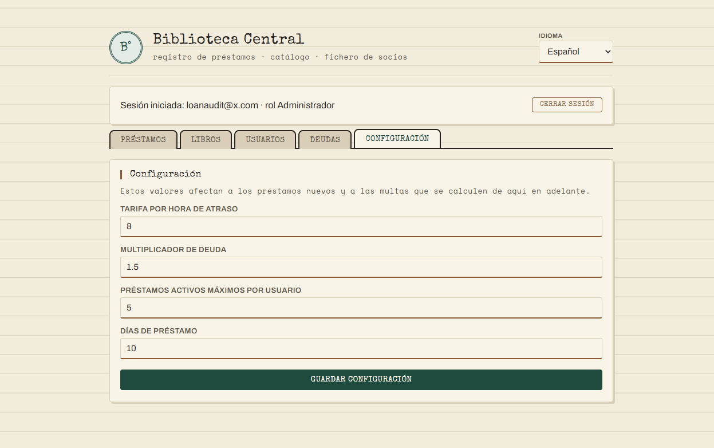
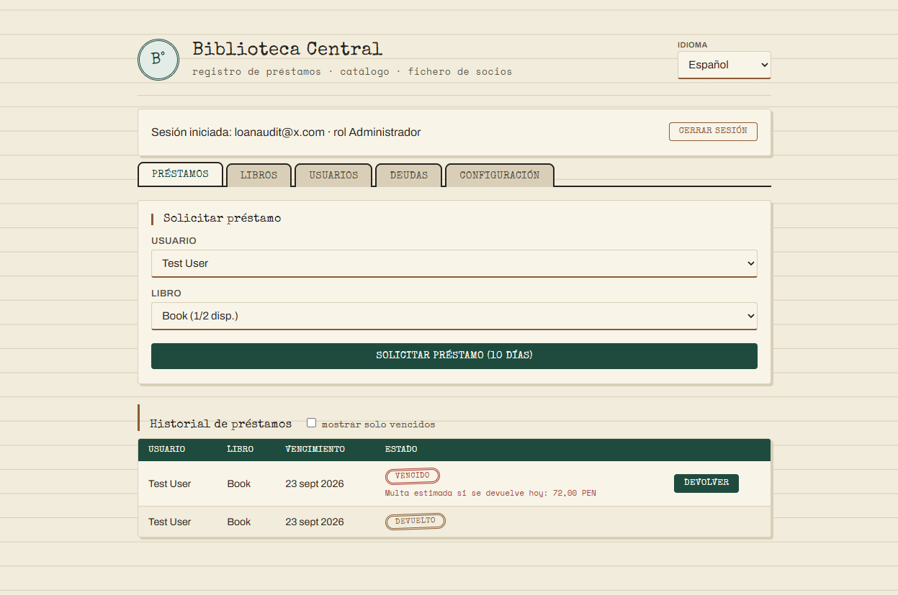
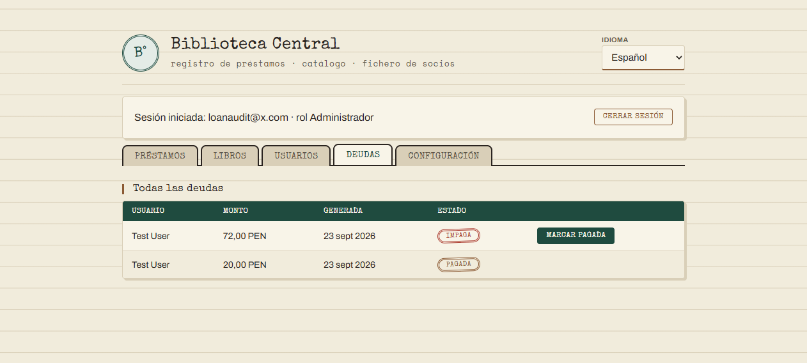

# Préstamos: configuración de multas y nueva restricción por atraso

Documento de entrega. Reemplaza la tarifa fija por día (500, sin poder
cambiarla) por una configuración real editable por el administrador, agrega
una restricción que faltaba (no prestar a quien tiene un préstamo vencido
sin devolver) y expone la multa de forma **provisional**, antes de que el
libro se devuelva.

Ver también: `docs/FUNCIONES.md` (§1, la función `calculateFine` actualizada).

---

## 1. Qué cambió en la multa

| | Antes | Ahora |
|---|---|---|
| Unidad de cobro | Por día completo | **Por hora**, fracción redondeada hacia arriba |
| Tarifa | 500 fija, hardcodeada | `hourlyLateFeeRate`, configurable |
| Recargo | Ninguno | `debtMultiplier`, configurable (1 = sin recargo) |
| ¿Quién la cambia? | Nadie (constante en el código) | El ADMINISTRADOR, desde la pestaña **Configuración** |

Fórmula: `multa = ceil(horas de atraso) × tarifa por hora × multiplicador`,
redondeada al sol más cercano.

## 2. Nueva restricción: préstamo vencido bloquea préstamos nuevos

Antes, un usuario con un libro vencido pero **sin devolver todavía** podía
seguir pidiendo prestado — porque la deuda recién se genera al devolver (ver
`docs/FUNCIONES.md`), y la única validación existente era "no tener deudas
impagas". Ahora `createLoan` también revisa si el usuario tiene algún
préstamo `ACTIVE` cuya fecha de vencimiento ya pasó, y lo bloquea con el
código `USER_HAS_OVERDUE_LOAN` — aunque todavía no le hayan cobrado nada.

## 3. Multa provisional (función stateless reutilizada)

Cada préstamo que devuelve la API (`GET /loans`, `GET /users/:id/loans`)
ahora incluye `provisionalFine`: lo que costaría la multa **si se devolviera
en este momento**. Es puramente informativo — no crea ninguna deuda, es
`null` si el préstamo no está vencido o ya fue devuelto.

Se calcula con la misma función pura `calculateFine` que usa la devolución
real, solo que con `new Date()` en vez de la fecha real de devolución — por
eso alcanzó con reutilizarla en vez de escribir una función aparte.

## 4. Configuración (`Settings`)

Nueva tabla `settings` (fila única), editable solo por ADMINISTRADOR:

| Campo | Descripción | Valor por defecto |
|---|---|---|
| `hourlyLateFeeRate` | Soles por hora de atraso | 5 |
| `debtMultiplier` | Multiplicador sobre horas × tarifa | 1 |
| `maxActiveLoans` | Préstamos activos simultáneos por usuario | 3 |
| `loanPeriodDays` | Días de plazo de un préstamo nuevo | 14 |

Endpoints: `GET /api/v1/settings` (BIBLIOTECARIO o ADMINISTRADOR — el
bibliotecario también necesita saber la política vigente), `PUT
/api/v1/settings` (solo ADMINISTRADOR). Los préstamos ya creados no cambian
de plazo si se edita `loanPeriodDays` después — la fecha de vencimiento se
calculó y guardó al momento de crear cada préstamo.

---

## 5. Capturas

**Pestaña "Configuración"** (solo visible para ADMINISTRADOR; un
BIBLIOTECARIO no la ve, aunque sí puede leer los valores vigentes vía API):



**Multa provisional** en el historial de préstamos — el libro sigue sin
devolverse, no hay ninguna deuda todavía, pero ya se muestra cuánto
costaría devolverlo hoy:



**Después de devolver**: la multa provisional se vuelve una deuda real, con
la tarifa y el multiplicador vigentes en ese momento:



---

## 6. Pruebas

7 tests nuevos (`node:test`) sobre `LoanService`/`SettingsService`, con
repositorios en memoria (mismo patrón que `AuthService.test.ts` /
`BookService.test.ts`):

- `calculateFine`: sin atraso, redondeo de fracción de hora, multiplicador.
- Un préstamo vencido sin devolver bloquea un préstamo nuevo aunque no haya
  deuda (regresión directa del punto 2).
- `maxActiveLoans`/`loanPeriodDays` configurables se respetan al crear.
- `provisionalFine` aparece en la lista sin generar ninguna deuda.
- `returnLoan` genera la deuda con la tarifa/multiplicador vigentes.
- `SettingsService` valida rangos (tarifa ≥ 0, multiplicador > 0, enteros
  positivos para `maxActiveLoans`/`loanPeriodDays`).

```
backend:  npm test           → 27/27 ✔
backend:  npm run i18n:check → completo
frontend: npm test           → 11/11 ✔
```

Verificado también en vivo contra un backend real (no solo con los repos en
memoria de los tests): préstamo vencido bloqueado, multa provisional
calculada correctamente (ceil de horas × tarifa × multiplicador), deuda
generada al devolver con el mismo monto que mostraba la vista previa.
