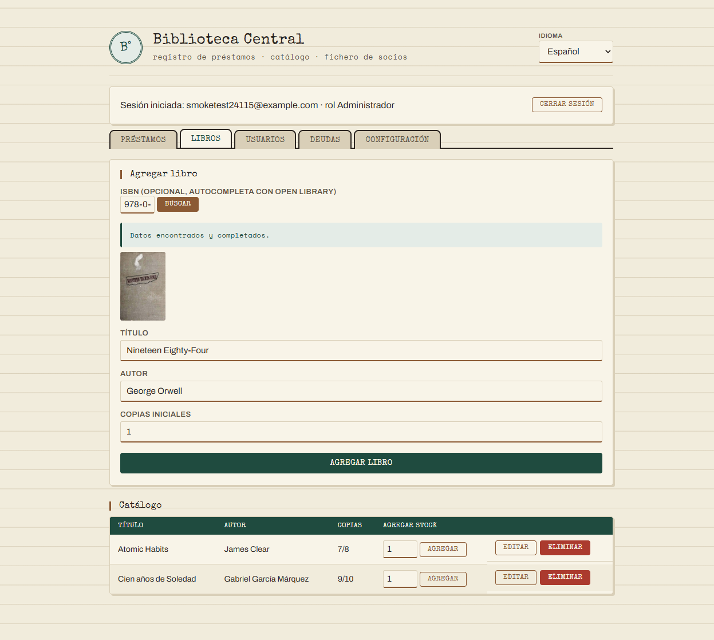

# Servicio externo: Open Library (búsqueda de libros por ISBN)

Documento de entrega. Integra el frontend con un servicio externo real —
[Open Library](https://openlibrary.org) — para autocompletar título, autor
y portada al dar de alta un libro, en vez de tipearlo todo a mano.

---

## 1. Por qué Open Library

Evaluado contra otras opciones (QR, mapas, feriados, frases — ver
comparativa discutida con el usuario antes de implementar):

- **Encaja en el dominio real** de la app (catálogo de libros), no es un
  agregado cosmético.
- **Gratis, sin API key, CORS abierto** — se consume directo desde el
  navegador con `fetch()`, mismo patrón que ya usa la app para las tasas de
  cambio (`open.er-api.com`).
- Aporta valor real: menos tipeo, menos errores de transcripción, y
  portadas reales en el catálogo en vez de solo texto.

## 2. Cómo funciona

En la pestaña **Libros**, arriba del formulario "Agregar libro" hay un
campo ISBN opcional con un botón "Buscar":

1. Se valida el formato del ISBN (10 u 13 dígitos, con posible `X` de
   checksum al final) con una regex — igual patrón que la validación de
   otros formularios (`docs/validacion-regex.md`).
2. Se consulta `https://openlibrary.org/search.json?isbn=<isbn>` (un solo
   request; trae título, autor y el id de la portada en la misma
   respuesta).
3. Si hay resultado: se llenan los campos Título/Autor y se muestra la
   portada (`https://covers.openlibrary.org/b/id/<id>-M.jpg`).
4. Si no hay resultado, el ISBN es inválido, o el servicio está caído: se
   muestra un mensaje y **el alta manual del libro sigue funcionando
   normalmente** — el servicio externo nunca bloquea el flujo principal.

## 3. Dónde vive el código

```
frontend/openLibrary.js       — módulo del servicio externo
frontend/openLibrary.test.js  — 7 tests (node:test)
```

Mismo patrón que `format.js`/`validators.js`: separa lo **puro** de lo que
tiene **efecto**.

```js
// puro — mismo input, mismo output, sin red (testeado sin mocks)
normalizeIsbn(raw)              // quita guiones/espacios
isValidIsbn(raw)                // regex ISBN-10 / ISBN-13
searchUrl(isbn)                 // arma la URL de Open Library
coverUrl(coverId, size)         // arma la URL de la portada
parseSearchResponse(json)       // JSON crudo de Open Library -> {title, author, coverUrl} | null

// con efecto — el único que hace la llamada real
fetchBookByIsbn(isbn)           // fetch + parseSearchResponse
```

`index.html` solo llama a `OpenLibrary.isValidIsbn` y
`OpenLibrary.fetchBookByIsbn`, y decide qué mostrar según el resultado — no
conoce el formato de la respuesta de Open Library.

## 4. Capturas

Búsqueda real en vivo por ISBN (`978-0-451-52493-5`, *1984* de George
Orwell) — título, autor y portada completados automáticamente:



## 5. Pruebas

7 tests (`node:test`) sobre las funciones puras del módulo — normalización
de ISBN, validación de formato, armado de URLs, y parseo de la respuesta
(incluye el caso de múltiples autores y el caso sin resultados). No hay
tests que llamen a la red real (mismo criterio que el resto del proyecto:
la lógica se testea con fixtures, no contra el servicio en vivo).

```
frontend: npm test → 20/20 ✔ (13 anteriores + 7 nuevos)
backend:  npm run i18n:check → completo (4 idiomas)
```

Probado también en vivo contra `openlibrary.org` real (no solo con
fixtures): ISBN válido y existente completa los 3 campos correctamente;
ISBN con formato inválido (`12345`) se rechaza sin llamar a la red.

> Nota de comportamiento: la búsqueda de Open Library no siempre es
> estrictamente exacta — un ISBN sintácticamente válido pero inventado
> (ej. `0000000000`) puede devolver un resultado aproximado en vez de "no
> encontrado", porque así responde la API del servicio externo. Es un
> comportamiento del proveedor, no del código de este proyecto; de todas
> formas nunca bloquea que el bibliotecario corrija los datos a mano antes
> de guardar.
