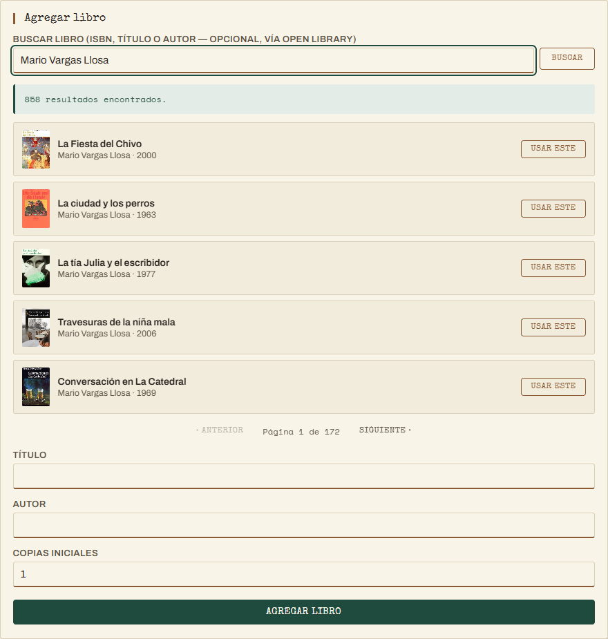

# Servicio externo: Open Library (búsqueda de libros)

Documento de entrega. Integra el frontend con un servicio externo real —
[Open Library](https://openlibrary.org) — para autocompletar título, autor
y portada al dar de alta un libro, en vez de tipearlo todo a mano. Admite
tanto ISBN exacto como búsqueda amplia por título o autor, paginada.

---

## 1. Por qué Open Library

Evaluado contra otras opciones (QR, mapas, feriados, frases — ver
comparativa discutida con el usuario antes de implementar):

- **Encaja en el dominio real** de la app (catálogo de libros), no es un
  agregado cosmético.
- **Gratis, sin API key, CORS abierto** — se consume directo desde el
  navegador con `fetch()`, mismo patrón que ya usa la app para las tasas de
  cambio (`open.er-api.com`).
- Aporta valor real: menos tipeo, menos errores de transcripción, portadas
  reales en el catálogo, y encontrar un libro sin saberse el ISBN de
  memoria — que es el caso normal en una biblioteca.

## 2. Cómo funciona

En la pestaña **Libros**, arriba del formulario "Agregar libro" hay un
único campo de búsqueda (ancho completo, igual que Título/Autor) con un
botón "Buscar". Un mismo cuadro cubre dos casos:

**ISBN exacto** (ej. `978-0-451-52493-5`): se detecta por formato (regex
ISBN-10/13, igual patrón que el resto de validaciones del proyecto —
`docs/validacion-regex.md`) y se resuelve directo, sin lista: título,
autor y portada se completan en un solo paso.

**Texto libre** (título, autor, o ambos — ej. `Mario Vargas Llosa`): dispara
una búsqueda general contra Open Library, paginada de a 5 resultados. Cada
resultado muestra portada, título, autor y año, con un botón "Usar este"
que completa el formulario. Con autores prolíficos esto puede devolver
cientos de resultados (858 para Vargas Llosa) — por eso la paginación, en
vez de tirar todo de una:



Si no hay resultado, el texto no parece un libro real, o el servicio está
caído: se muestra un mensaje y **el alta manual del libro sigue
funcionando con normalidad** — el servicio externo nunca bloquea el flujo
principal.

## 3. Dónde vive el código

```
frontend/openLibrary.js       — módulo del servicio externo
frontend/openLibrary.test.js  — 13 tests (node:test)
```

Mismo patrón que `format.js`/`validators.js`: separa lo **puro** de lo que
tiene **efecto**.

```js
// puro — mismo input, mismo output, sin red (testeado sin mocks)
normalizeIsbn(raw)                    // quita guiones/espacios
isValidIsbn(raw)                      // regex ISBN-10 / ISBN-13
isbnSearchUrl(isbn)                   // URL de búsqueda exacta por ISBN
querySearchUrl(query, page, limit)    // URL de búsqueda general, paginada
coverUrl(coverId, size)               // URL de la portada
parseBookDoc(doc)                     // un resultado crudo -> {title, author, year, coverUrl}
parseSearchResults(json, page, limit) // página completa -> {results[], page, totalPages, numFound}
parseSearchResponse(json)             // caso ISBN: primer resultado o null

// con efecto — las únicas que hacen la llamada real
fetchBookByIsbn(isbn)                 // ISBN exacto
fetchBooksByQuery(query, page, limit) // búsqueda general, una página
```

`index.html` decide cuál de las dos llamadas hacer según
`OpenLibrary.isValidIsbn(texto)`, y solo llama a `applyBookResult()` /
`renderSearchResults()` con lo que el módulo ya le devuelve parseado — no
conoce el formato de la respuesta de Open Library.

## 4. Pruebas

13 tests (`node:test`) sobre las funciones puras del módulo — normalización
y validación de ISBN, armado de las dos URLs (exacta y de búsqueda
paginada), parseo de un doc individual y de una página completa de
resultados (incluye el caso de múltiples autores, sin año/portada, y sin
resultados). No hay tests que llamen a la red real (mismo criterio que el
resto del proyecto: la lógica se testea con fixtures, no contra el
servicio en vivo).

```
frontend: npm test → 24/24 ✔
backend:  npm run i18n:check → completo (4 idiomas)
```

Probado también en vivo contra `openlibrary.org` real (no solo con
fixtures): búsqueda por autor devuelve los 858 resultados esperados
paginados correctamente (172 páginas de 5), "Usar este" completa el
formulario, ISBN exacto sigue resolviendo directo sin pasar por la lista,
y una búsqueda vacía se rechaza sin llamar a la red.

> Nota de comportamiento: la búsqueda de Open Library no siempre es
> estrictamente exacta — un ISBN sintácticamente válido pero inventado
> (ej. `0000000000`) puede devolver un resultado aproximado en vez de "no
> encontrado", porque así responde la API del servicio externo. Es un
> comportamiento del proveedor, no del código de este proyecto; de todas
> formas nunca bloquea que el bibliotecario corrija los datos a mano antes
> de guardar.

---

## 5. Qué otros metadatos se podrían guardar (evaluación a futuro)

Hoy la app **solo usa** Open Library para autocompletar el formulario —
nada de lo que trae (año, portada, ISBN) se guarda en la base de datos; el
`Book` de este proyecto sigue siendo únicamente `{title, author}`. Abajo,
una evaluación de qué más convendría persistir si el catálogo creciera más
allá de una demo, ordenada por relación esfuerzo/valor.

| # | Campo | De dónde sale | Esfuerzo | Valor | Nota |
|---|---|---|---|---|---|
| 1 | **`coverUrl`** | `cover_i` → `covers.openlibrary.org` | Bajo — 1 columna `TEXT` nullable, sin migración de datos | Alto | Ya se descarga para el formulario; guardarlo permite mostrar portada en el catálogo y en la fila de préstamos, no solo al dar de alta. Es una URL externa: si Open Library la mueve o el libro se borra de su catálogo, la imagen puede dejar de cargar — hay que decidir un ícono de reemplazo. |
| 2 | **`isbn`** | `isbn[0]` del resultado | Bajo — 1 columna, útil como campo de búsqueda/índice propio | Alto | Permite buscar en el catálogo propio por ISBN (hoy no se puede) y evita alta duplicada del mismo libro físico. Candidato natural a `UNIQUE`, pero cuidado: dos ediciones distintas del mismo título tienen ISBN distinto — no reemplaza la lógica de "libro" vs "copia" que ya existe (`BookCopy`). |
| 3 | **`publishYear`** | `first_publish_year` | Bajo | Medio | Dato de catálogo típico (ficha bibliográfica), útil para ordenar/filtrar. Sin impacto en ninguna regla de negocio existente. |
| 4 | **`subjects` / género** | `subject` (requiere pedir ese campo aparte, no viene en la búsqueda liviana actual) | Medio — nueva llamada o campo adicional en `fields`, más una tabla si se quiere filtrar por género | Alto | Es lo que habilita "explorar por categoría" en el catálogo — probablemente el metadato con más impacto de usabilidad real después de la portada, pero el que más cambia el modelo de datos (¿un género por libro o varios?). |
| 5 | **`description`** (sinopsis) | Viene del *work*, no de la búsqueda por ISBN — requiere una llamada extra a `/works/{id}.json` | Medio-alto — otra petición encadenada, texto largo | Medio | Bonito para una ficha de detalle del libro, pero no crítico: nadie presta un libro por su sinopsis. Encarece cada alta con una llamada de red adicional. |
| 6 | **`language`** | `language` | Bajo | Bajo | Solo relevante si la biblioteca maneja libros en varios idiomas como dato explícito de filtro; hoy no hay ese caso de uso. |
| 7 | **`pageCount`** | No viene en `search.json`; requiere `/isbn/{isbn}.json` aparte | Medio | Bajo | Dato de catálogo menor, ningún flujo actual lo necesita. |

**Recomendación** si se quisiera avanzar: **portada + ISBN** primero (#1 y
#2) — mismo request que ya se hace hoy, cero llamadas nuevas, la migración
de esquema es mínima (2 columnas nullable), y es lo que un catálogo de
biblioteca "se ve raro sin tener". Género (#4) es el siguiente escalón
natural pero implica una decisión de modelo (uno vs. varios por libro) que
vale la pena conversar antes de tocar el schema.

No se implementó ninguno de estos en esta entrega — es evaluación, a la
espera de que se decida cuál (si alguno) vale la pena para la siguiente
iteración.
