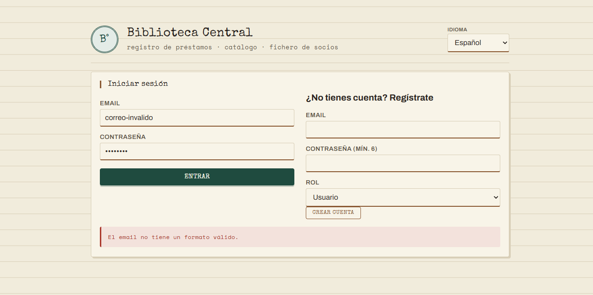
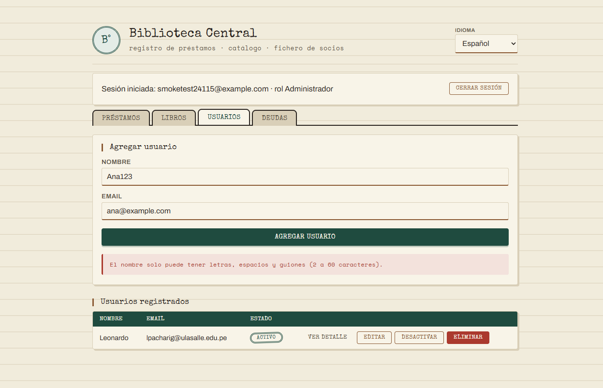
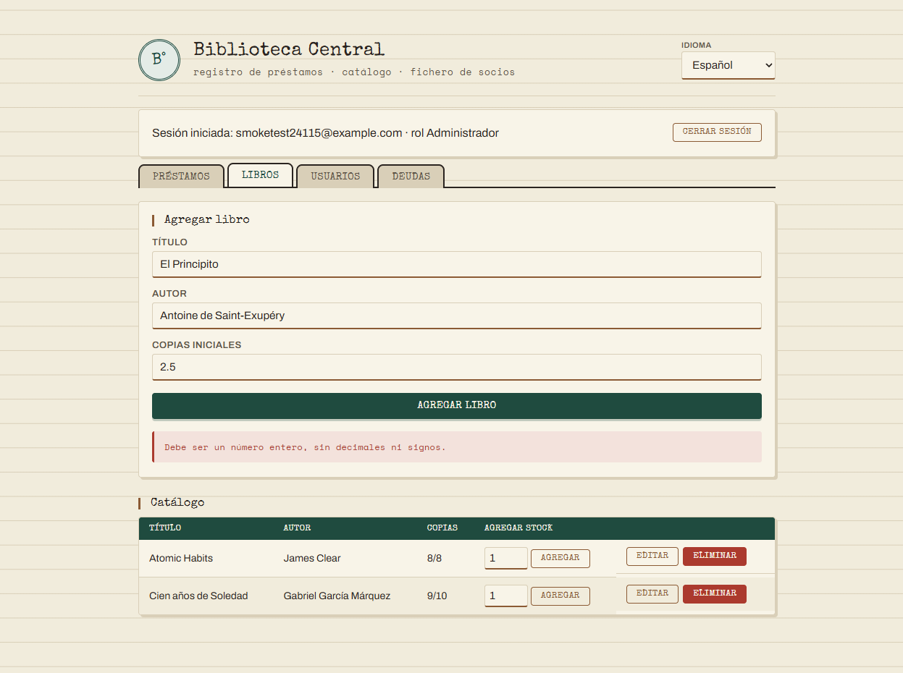

# Validación de formularios con expresiones regulares

Documento de entrega. Resume la validación por regex agregada a los
formularios del sistema, en dos capas: frontend (feedback inmediato) y
backend (autoridad real de seguridad — nunca se confía solo en el cliente).

---

## 1. Por qué dos capas

Antes de esto, la única validación de formato era `email.includes("@")` en
el backend (aceptaba literalmente `"@"` o `"a@"` como email válido) y nada
en el frontend — cualquier error de tipeo llegaba hasta el servidor y volvía
como un error genérico.

- **Backend** (`backend/src/domain/validation/patterns.ts`): regex real,
  es la que de verdad decide si un dato entra a la base de datos. No se
  puede saltar enviando requests directas a la API.
- **Frontend** (`frontend/validators.js`): las mismas reglas (más una extra,
  fuerza de contraseña), para que el usuario vea el error al instante, sin
  esperar un viaje de red. Es una capa de UX, no de seguridad — están
  duplicadas a propósito porque son dos runtimes sin build compartido.

---

## 2. Patrones

| Regex | Campo | Bloquea |
|---|---|---|
| `^[^\s@]+@[^\s@]+\.[^\s@]+$` | Email (login, registro, socio) | Sin `@`, sin dominio, con espacios |
| `^(?=.*[A-Za-z])(?=.*\d).{6,}$` | Contraseña (solo registro) | Menos de 6 caracteres, o sin letra+número |
| `^[\p{L}\s'.,-]{2,60}$` (Unicode, incl. acentos/ñ) | Nombre de socio | Dígitos, símbolos, o fuera del rango 2-60 |
| `^\d+$` | Copias iniciales / stock a agregar | Decimales, negativos, notación científica (`1e5`) — que un `<input type="number">` deja pasar solo |

La contraseña **no** se valida por patrón en el login (solo en registro):
así no se bloquean cuentas ya creadas con contraseñas que no cumplan la
regla nueva.

---

## 3. Dónde vive el código

```
backend/src/domain/validation/
  patterns.ts        — isValidEmail, isValidName (regex + tests)
  patterns.test.ts

frontend/
  validators.js       — las 4 reglas, mismo patrón UMD que format.js/i18n.js
  validators.test.js
```

En `index.html`, cada botón de envío llama a `validateField(valor, regla,
claveDeMensaje, elementoDeResultado)` antes de tocar la red:

```js
document.getElementById('regSubmit').addEventListener('click', async () => {
  const email = document.getElementById('regEmail').value;
  const password = document.getElementById('regPassword').value;
  if (!validateField(email, isValidEmail, 'validation.emailInvalid', authResultEl)) return;
  if (!validateField(password, isValidPassword, 'validation.passwordWeak', authResultEl)) return;
  // recién acá se llama a fetchJson(...)
});
```

Los mensajes de error salen del mismo catálogo de i18n ya existente
(`validation.*` en `es/en/ar/fr.json`) y se muestran con el mismo
`showResult()` que usa el resto de la app — ninguna UI nueva.

---

## 4. Capturas — validación bloqueando el envío

**Email con formato inválido** (login):



**Nombre con dígitos** (alta de socio):



**Cantidad no entera** (alta de libro, "2.5" copias):



En los tres casos el mensaje aparece **sin que se haya llamado al backend**
— se puede confirmar porque no hay ninguna petición de red en el momento del
click, solo al corregir el dato y reenviar.

---

## 5. Pruebas

8 tests nuevos (`node:test`), mismo runner ya usado en el proyecto:

- `backend/.../validation/patterns.test.ts` (4): casos válidos e inválidos
  de email y nombre, incluyendo trim de espacios y límites de longitud.
- `frontend/validators.test.js` (4): las 4 reglas, incluyendo el caso que
  motivó la regla de enteros (`"1e3"` y `"1.5"` deben rechazarse).

`npm test` (backend y frontend) y `npm run i18n:check` (backend) quedan en
verde con los nuevos textos de validación incluidos.

---

## 6. Estado de despliegue

Verificado en producción, no solo en local:

| Componente | URL | Verificación |
|---|---|---|
| Backend (Cloud Run) | https://biblioteca-backend-438047115829.us-central1.run.app | `POST /auth/register` con email inválido → `{"code":"EMAIL_INVALID",...}` |
| Frontend (Cloudflare Workers) | https://biblioteca-central.readuls.workers.dev | `validators.js` sirviendo 200 |

Las capturas de la sección 4 se tomaron sirviendo el mismo `index.html` en
local, pero contra el backend real de producción (las llamadas de red van a
la URL de Cloud Run de arriba) — la lógica de validación es idéntica a la
que corre en la versión desplegada.
